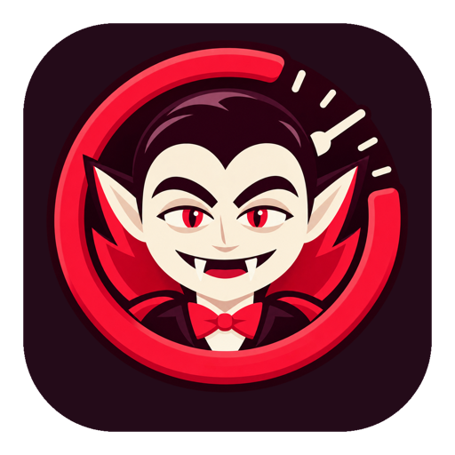
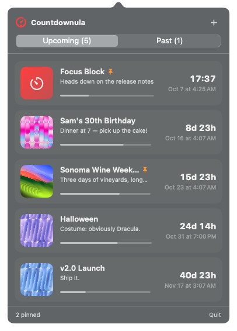
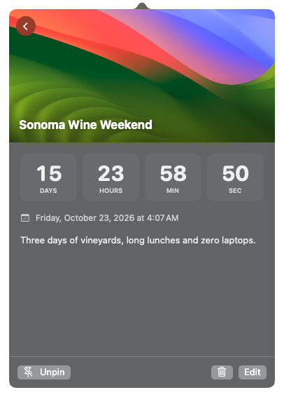
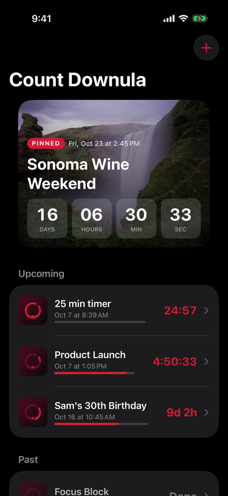
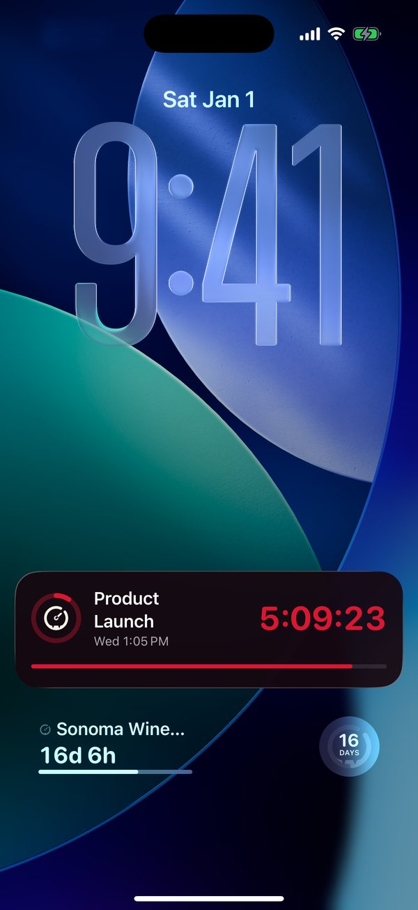
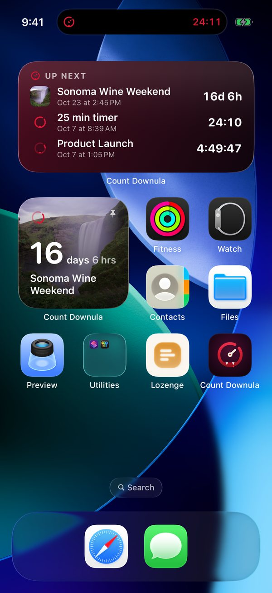
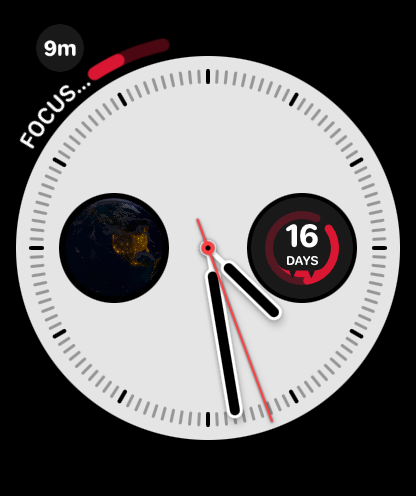
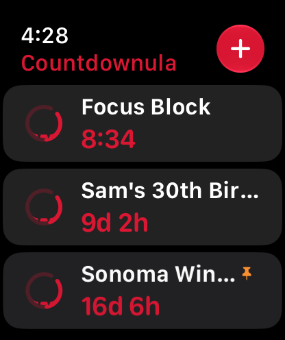

# Count Downcula



Native countdowns for vacations, launches, birthdays, or a quick timer: a macOS menu bar app, an iPhone app with widgets and Live Activities, and an Apple Watch app with complications. Share a countdown as a live link and friends count down with you, on the web or in the app.

The app shows up as **Count Downcula** everywhere you see it. The project, targets, files, bundle IDs and iCloud container keep the original one-word name, `Countdownula`, from when the app was called Count Downula (renamed in October 2026).

[](https://github.com/mrlynn/count-downula/releases/latest)


<p>
  
  
</p>

- Click the fanged timer in the menu bar to see **Upcoming** and **Past** countdowns.
- **Desktop widgets:** the Countdown widget (small to extra large) and the Up Next list, on the desktop or in Notification Center. Click one to open that countdown.
- Each countdown has a **title**, **description**, **photo**, and either a target **date & time**, a **timer** duration, or a **start date to count up from** (time since quitting smoking, getting sober, meeting someone).
- **Milestones** mark the moments along the way ("Halfway there", "1 week to go", "90 days"), each with its own notification and, on iPhone, a burst of confetti.
- **Pin** any countdown and it gets its own live menu bar item (photo thumbnail + title + time left). Click it to jump straight to its details.
- A notification fires when a countdown finishes.
- **iCloud sync** keeps countdowns and photos in step between your Mac, iPhone and Apple Watch.
- **Shared countdowns** you join on iPhone show up in the menu bar too and stay in step with the owner. The Mac checks for changes every 15 minutes, so it keeps them current while the phone sleeps.

## iPhone

<p>
  
  
  
</p>

The iPhone (and iPad) app lists your countdowns with the next one up as a full-bleed card, shows a live days/hours/minutes/seconds view, and lets you add or edit countdowns with a photo from your library. The **+** button also offers one-tap quick timers. It schedules its own alerts and syncs with the Mac and watch through iCloud.

- **Appearance:** give each countdown its own background (your photo, one of 22 built-in scenes, a gradient or a color), font and colors. Occasion scenes (Wedding, Birthday, Baby, Graduation, Hearts, Fireworks, Airplane, Beach, Game Day, Campfire) come first. Widgets, the watch and the Mac use it too.
- **Count up:** track the time since something began, with standard milestones (24 hours, 1 week, 30/60/90 days, 6 months, every year), money saved per day, and a gentle **Reset** that keeps your history and best run. Templates for Sober, Smoke-Free, Together and New Job.
- **Repeats every year:** birthdays and anniversaries roll over to next year once the day has passed.
- **Ways to count:** each countdown can count in days and hours, weeks, sleeps (from a bedtime you pick), workdays, weekends or percent of the way there, everywhere it shows: widgets, the watch, the menu bar, share cards and the live page. A date can be set in another time zone ("landing in Tokyo at 6:40pm"), and the detail screen shows it in both.
- **Vampire hours:** built-in countdowns to the next sunrise, sunset and full moon that roll forward on their own.
- **From Calendar and Contacts:** pick events from the next 90 days of your calendars (on iPhone and the Mac), or birthdays from your contacts (iPhone), and each becomes a countdown with a fitting scene, keeping the event's repeat when it's on a fixed date.
- **From a screenshot:** share a ticket, invite or confirmation (image, PDF or text) to Count Downcula and it drafts the countdown: title, date, place and a fitting scene. Siri and Shortcuts can ask how long until a countdown, start a timer or add one, and countdowns show up in Spotlight.
- **Share as image or video:** a 1080 × 1350 card, or a 6 second 1080 × 1920 video, of any countdown for Messages or Instagram.
- **The Count's voice:** alerts and milestones written in Count Downcula's own voice, per countdown.
- **Pricing:** free for up to 3 active countdowns (timers and count-ups count, finished ones and shared countdowns you join don't). **Count Downcula Unlimited** is a one-time $2.99 in-app purchase that removes the limit on iPhone, iPad, Apple Watch and the Mac App Store version. The GitHub Mac download is always unlocked (`DIRECT_DISTRIBUTION`).

| Where | What |
|---|---|
| Home Screen | **Countdown** widget (small, medium, large) with the photo behind the time left, and an **Up Next** list (medium, large) |
| StandBy | The small Countdown widget, drawn to read on black |
| Lock Screen | Circular, rectangular and inline widgets, the same designs as the watch complications |
| Live Activity | Lock Screen banner and Dynamic Island with a live timer and progress ring |
| Control Center | **Quick Timer** (pick its length) starts a timer on the Lock Screen without opening the app, and **Next Up** shows your next countdown (iOS 18) |

Medium and larger Countdown widgets have buttons that work without opening the app: put it on the Lock Screen in its final 8 hours, pin or unpin it, and on a Next Up widget, step to the next countdown. iPad adds an extra-large size.

The Countdown widget follows **Next Up** (soonest pinned, otherwise soonest) or a countdown you pick. Tapping any widget or Live Activity opens that countdown.

**Pin** is the iPhone's version of the Mac's menu bar item: a pinned countdown is featured in widgets and goes live on the Lock Screen and in the Dynamic Island once it's in its final 8 hours (iOS ends Live Activities after 8 hours). New timers go live straight away, and any countdown in that window can be put on the Lock Screen from its detail screen.

## Count down together

**Share Live Link** publishes a countdown to `go.countdowncula.com/c/<slug>`: a live page that ticks on any browser, with a link preview that always shows today's number. Everything below builds on it. Private countdowns never leave iCloud; see the [server README](server/README.md) for what the server stores, and [docs/specs/viral-features.md](docs/specs/viral-features.md) for the design.

- **Join:** anyone with the link can count down with you in the app. Their copy follows your edits, with their own pin and alerts. No accounts: a random key in the iCloud Keychain.
- **App Clip:** people without the app open the link and get the countdown in an App Clip, with Keep It and Share.
- **Synchronized zero:** every phone in a shared countdown starts its Live Activity in the final 8 hours and celebrates at the same second.
- **Sealed coffin:** notes and photos people leave stay sealed on the server until zero, then open for everyone at once.
- **Date pools:** not sure when it happens (a baby, a ship date, the first snow)? Friends guess from the app or the web, and when the owner sets the real date the closest guess wins. Bragging rights only.
- **Apple Wallet:** add a shared countdown as a pass that comes to the Lock Screen on the day, with a QR code back to the live page. Owner edits update it.
- **Make one on the web:** no iPhone needed. [go.countdowncula.com/new](https://go.countdowncula.com/new) makes a live countdown with a scene, gradient or photo, editable from that browser or with an emailed edit link. Live pages offer it as **Make your own**.
- **The big screen:** put a countdown on a TV or projector for the party. The live page's **Present** button opens `/c/<slug>/present`: full screen in the countdown's style, with the last ten seconds as one huge number, confetti at zero, the screen kept awake, and a QR code in the corner so the room can join. The Mac app's **Present** (in the popover header and on each countdown) does the same full screen, on a second display if one is connected. An iPhone connected to a TV by AirPlay or a cable shows the countdown there instead of mirroring, and stays the remote.
- **The Crypt:** a curated list of public countdowns (holidays, eclipses, meteor showers, big games) at [go.countdowncula.com/crypt](https://go.countdowncula.com/crypt) and in the app. Holidays tick to midnight on each viewer's own clock.

## Apple Watch

<p>
  
  
</p>

The watch app ships inside the iPhone app and runs on its own once installed (it doesn't need the phone nearby). It lists your countdowns, shows a live days/hours/minutes/seconds view, and lets you start a quick timer or add a date right from your wrist. Countdowns sync with the Mac and iPhone through iCloud, and the watch schedules its own alerts.

**Complications** (WidgetKit) work on any face that has slots:

| Slot | Shows |
|---|---|
| Circular | The fanged ring drains as the date gets closer, with days (or hours, or a live timer) in the middle |
| Rectangular | Title, live time left and a progress bar; adds the photo on full-color faces and in the Smart Stack |
| Corner | Short time left with a curved gauge and the title |
| Inline | `Sonoma · 15d 23h` along the top of the face |

Each complication can follow **Next Up** (your soonest pinned countdown, otherwise the soonest one) or a specific countdown.

Apple doesn't allow third-party watch faces. To share a "Count Downcula face", set one up (Infograph or Modular work well, in a red color), then long-press it and choose **Share**. That creates a `.watchface` file anyone with the app can add in one tap.

## Apple TV

*Coming in a later release; it isn't part of 1.2.* The Apple TV app shows your countdowns, synced through iCloud from the iPhone, Mac and watch. It has the next one big and shelves of the rest, plus the Crypt, and any countdown goes full screen for the room at a press. Left and right on the remote step through them. When the app is in the top row, the Top Shelf shows what's coming up. Joined countdowns follow their owners' edits, and Crypt countdowns can be added from the TV.

## Download

The current Mac release is **1.1.1**. Grab **Countdownula-1.1.1.zip** from the [latest release](https://github.com/mrlynn/count-downula/releases/latest) (or [countdowncula.com/download](https://www.countdowncula.com/download)), unzip it, and drag **Countdownula.app** to `/Applications`.
It's a universal app (Apple Silicon + Intel) and needs macOS 14 Sonoma or later. Finder shows it as Count Downcula. This download is free and unlimited.

Count Downcula 1.1.0 is also in review for the App Store on iPhone, iPad, Apple Watch and Mac. Until it's out, the iPhone and Watch apps are in public beta at [countdowncula.com/beta](https://www.countdowncula.com/beta).

Releases from 1.1 on are signed with Developer ID and notarized by Apple, so the first launch only asks you to confirm opening an app downloaded from the internet.

## Build from source

Requires Xcode 16+ (macOS 14 / iOS 17 / watchOS 10 deployment targets), [XcodeGen](https://github.com/yonaskolb/XcodeGen) (`brew install xcodegen`), and an Apple Developer account. iCloud needs real signing. The project is defined in `project.yml`; the `.xcodeproj` is generated and not committed.

```bash
./scripts/build-app.sh          # signed Mac build → build/Countdownula.app
open build/Countdownula.app
```

The Mac target builds the **Mac App Store** version by default: sandboxed, with the free tier and the Unlimited purchase. The GitHub download is the same target built with `DIRECT_DISTRIBUTION` and `Resources/CountdownulaDirect.entitlements` (no sandbox); `scripts/release-mac.sh` passes both.

Debug Mac builds take optional launch arguments for screenshots: `-seedDemo` (sample countdowns, using macOS wallpapers as photos), `-openPopover` (opens the list at launch), `-select "<title>"` (opens that countdown in the popover), `-openEditor "<title>"`, `-openPaywall`, `-freeTier` (shows the free tier even after buying Unlimited) and `-localOnly` (no iCloud). The sandboxed build keeps its data in `~/Library/Containers/com.countdownula.app`, so `-seedDemo` only seeds when that store is empty; see `design/app-store/README.md`. An unsandboxed build can be pointed at a scratch home folder instead: build it with `DIRECT=1 scripts/build-app.sh debug`, then run:

```bash
CFFIXED_USER_HOME=/tmp/cd-demo .build/xcode/Build/Products/Debug/Countdownula.app/Contents/MacOS/Countdownula -localOnly -seedDemo -openPopover
```

To use your own team, change `DEVELOPMENT_TEAM` and the `com.countdownula.*` / `iCloud.com.countdownula.app` / `group.com.countdownula.app` identifiers in `project.yml` and `Sources/Shared/SharedConfig.swift`.

**iPhone app:** run `xcodegen generate`, open `Countdownula.xcodeproj`, pick the **CountdownulaiOS** scheme and your iPhone or a simulator, and click Run. The scheme has optional `-seedDemo` (sample data) and `-localOnly` (no iCloud) launch arguments. It shares the Mac app's bundle ID (`com.countdownula.app`) so the two can share an App Store record; the widget extension is `com.countdownula.app.widgets`.

**Languages:** the apps and the web pages come in English, Japanese, German, Spanish, Brazilian Portuguese and French (drafts awaiting native review). App text lives in `Resources/Localizable.xcstrings`; after changing what the app says, run `./scripts/sync-strings.sh` to add new strings to it (Xcode does the same on build). Web text lives in `server/src/lib/i18n.ts`.

**Changing the synced model:** CloudKit only accepts new `CountdownRecord` fields in Production after they exist in the Development schema and are deployed. Run a debug iPhone build, signed and signed into iCloud on the device or simulator, with the `-initializeCloudKitSchema` launch argument. It writes every field to Development using a throwaway store, without touching your countdowns. Check the result with `xcrun cktool export-schema --team-id YZ36Z8GSEN --container-id iCloud.com.countdownula.app --environment development`, then use **Deploy Schema Changes…** in the CloudKit Console. Production deploys can't be undone.

**Watch app:** run `xcodegen generate`, open `Countdownula.xcodeproj`, pick the **CountdownulaWatch** scheme and your watch, and click Run. Xcode registers the watch with your developer account the first time. In the simulator, the scheme has optional launch arguments: `-seedDemo` (sample data), `-complicationGallery` (renders every complication size), and `-localOnly` (no iCloud).

**Release (GitHub):** `NOTARY_PROFILE=countdownula scripts/release-mac.sh` archives the GitHub download, exports with Developer ID, notarizes, staples and zips the app. It also builds the screensaver, signs it with Developer ID and the hardened runtime, notarizes it, and zips it as `Count-Downcula-Screensaver-<version>.zip` to attach to the same release (double-clicking the `.saver` installs it). `VERSION=1.1.1` gives it its own version between App Store releases. After a release, update the version in `site/index.html` and `site/vercel.json` (see `site/README.md`). The `countdownula` profile is a notarytool keychain profile; the script header shows how to create one. Before the first public release, open the [CloudKit Console](https://icloud.developer.apple.com/), select `iCloud.com.countdownula.app`, and **Deploy Schema Changes** to Production. Release builds sync through the Production environment.

**Mac App Store:** `scripts/release-mac-appstore.sh` archives the sandboxed Mac build and uploads it to App Store Connect, the same way as the iPhone script below.

**TestFlight / App Store (iPhone, iPad and Watch):** create the app in App Store Connect with bundle ID `com.countdownula.app`, sign in to your Apple ID in Xcode → Settings → Accounts, then run `scripts/release-ios.sh`. It archives the iPhone app (with the watch app and both widget extensions embedded), signs it for the App Store and uploads it. The build shows up under TestFlight after processing. Each upload needs a new build number: the script uses a timestamp, or pass one (`scripts/release-ios.sh 3`). `UPLOAD=0` exports the `.ipa` without uploading, and `ASC_KEY_ID` / `ASC_ISSUER_ID` / `ASC_KEY_PATH` switch to App Store Connect API key auth for CI.

**TestFlight / App Store (Apple TV):** add the tvOS platform to the same app in App Store Connect (the TV app shares the bundle ID `com.countdownula.app`, so Unlimited is one universal purchase), then run `scripts/release-tvos.sh`. It works like the iPhone script and embeds the Top Shelf extension. The layered icon and Top Shelf images come from `scripts/render-tv-assets.swift`.

## Logo

The mark is a countdown timer whose lower jaw bares two fangs. Sources live in `design/`:

| File | Use |
|---|---|
| `app-icon.svg` | Full-color app icon (blood-red ring, bone fangs and hand, midnight squircle) |
| `mark.svg` | Monochrome mark for docs and marketing |
| `mark-menubar.svg` | Menu bar variant: tighter crop and bigger fangs so it reads at 18pt |
| `app-icon-watch.svg` | Full-bleed watch icon (watchOS masks it to a circle) |

After editing an SVG, regenerate `Resources/AppIcon.icns`, the watch icon and the menu bar PNGs:

```bash
swift scripts/render-icons.swift
```

## Data

Countdowns live in a SwiftData store (`~/Library/Application Support/Countdownula/Countdownula.store` for the GitHub Mac download, inside `~/Library/Containers/com.countdownula.app` for the Mac App Store version) that syncs through your **private** iCloud database. Photos are stored as a 1400px JPEG plus a 240px thumbnail. Version 1.0's `countdowns.json` is imported automatically on first launch and renamed to `countdowns.imported.json`.

## Layout

| Path | Purpose |
|---|---|
| `Sources/Shared/` | `Countdown` model and formatting, SwiftData `CountdownRecord`, `CountdownRepository` (CRUD + CloudKit), `WidgetSnapshot` (App Group hand-off to complications), `FangMark` (the logo drawn in SwiftUI, doubling as a progress dial) |
| `Sources/Countdownula/` | Mac app: status items and popover (`AppDelegate`), `CountdownStore`, popover, editor and paywall views |
| `Sources/CountdownulaiOS/` | iPhone and iPad app: `PhoneStore` (sync, snapshot, alerts), `LiveActivities`, list, detail and editor views |
| `Sources/CountdownulaiOSWidgets/` | iPhone widget extension: Home Screen and StandBy widgets, Up Next list, Live Activity and Dynamic Island |
| `Sources/PhoneShared/` | Shared by the iPhone app and its widgets: Live Activity attributes, deep links, image downsampling |
| `Sources/CountdownulaWatch/` | Watch app: `WatchStore` (sync, snapshot, alerts), list, detail and add views, debug complication gallery |
| `Sources/CountdownulaWidgets/` | Configuration intent, timeline provider and accessory views shared by the watch complications and iPhone Lock Screen widgets |
| `Sources/CountdownulaClip/` | App Clip: opens a shared countdown from its link without the app |
| `Sources/CountdownulaShare/` | Share Extension: drafts a countdown from an image, PDF or text |
| `server/` | Next.js server on Vercel for live links, shared countdowns, the coffin, date pools, Wallet passes and the Crypt ([README](server/README.md)) |
| `site/` | The countdowncula.com marketing site ([README](site/README.md)) |
